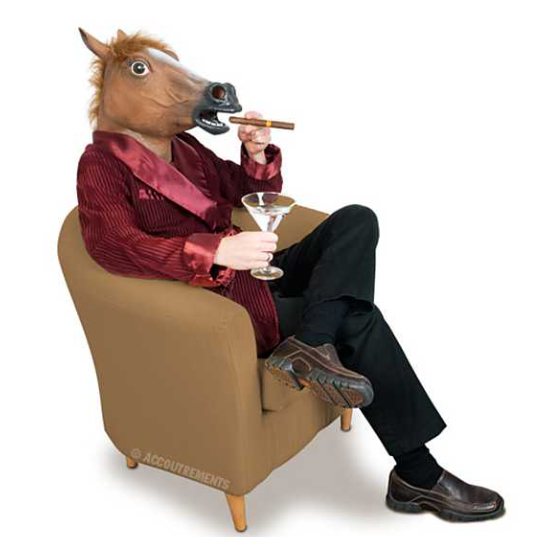
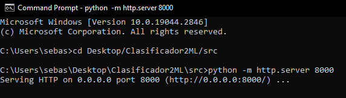
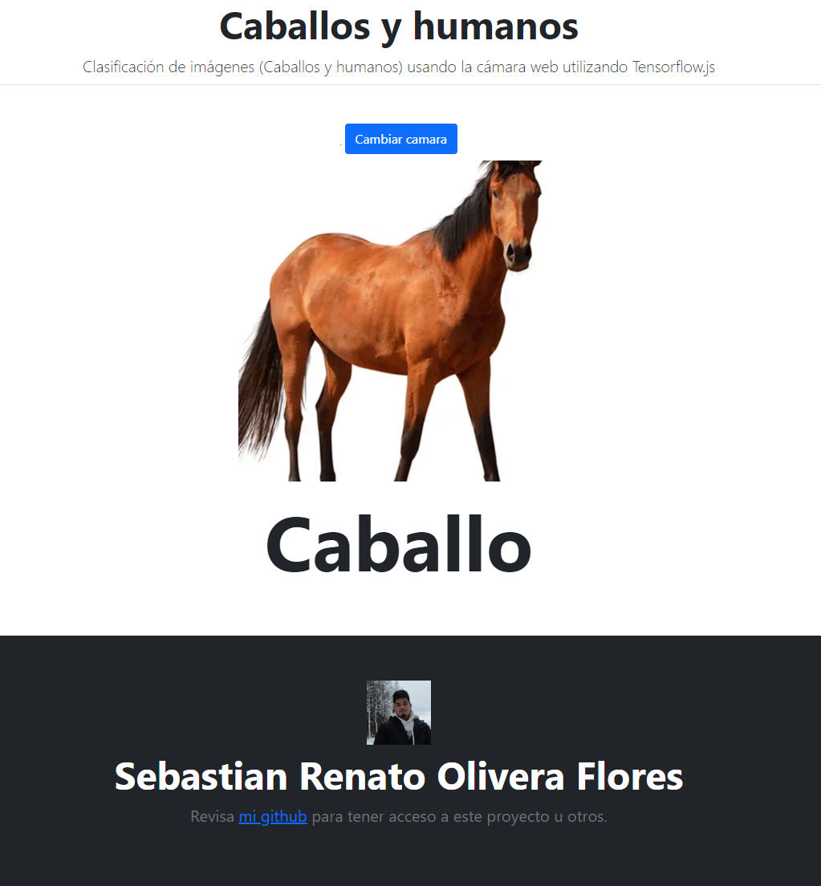

# Clasificador de imagenes de humanos y caballos

Este modelo de tensorflow sirve para diferenciar a personas de caballos, como base para una futura herramienta de difuminación de imágenes.
Este código representa el sitio web, una vez que se crea y entrena el modelo de inteligencia artificial con Python y Tensorflow, el cual es exportado a los archivos "json" y "bin".

## Pasos a seguir para su utilización

### Comprobar el "requirements.txt" 
Con esto nos aseguramos que no haya ningun problema de compatibilidad entre versiones.
### Clonar o descargar el repositorio
Con esto podras ejecutar el programa manualmente para su utilización.

### Iniciamos un servidor local a traves del cmd
Debemos iniciar un servidor local para poder utilizar nuestro modelo en formato http. Ya que no nos seria posible ejercutarlo debido a que este proyecto esta basado en Tensorflow.js.
La forma mas simple de realizar este proceso:
- Abre una línea de comandos o terminal (cmd como administrador)
- Nos dirigimos a la carpeta en la que se encuentra el repositorio
- Ejecuta el comando `python -m http.server 8000`
- Abre un explorador y ve a http://localhost:8000

## Enhorabuena, ya puedes utilizar el modelo!

